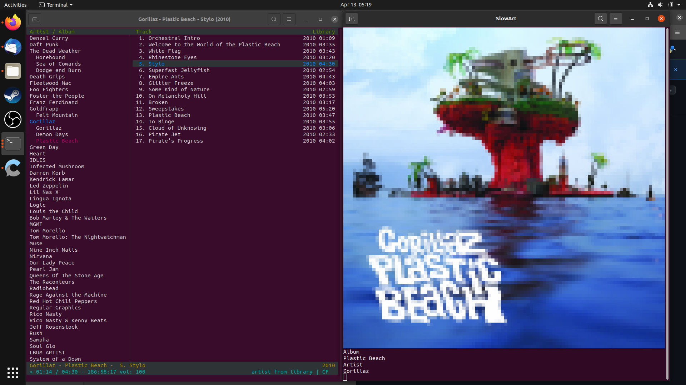
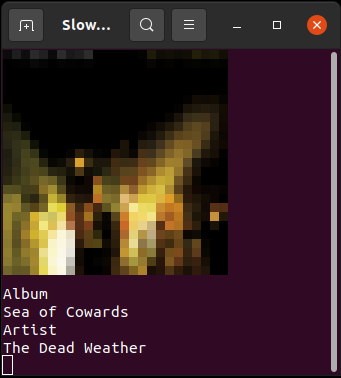

# Slow-Art for C\*Mus

## About

This is an album art viewer that runs in terminal for [C\*Mus](https://cmus.github.io/). Using [catimg](https://github.com/posva/catimg) to print the image, and inotify. Please enjoy

## Install Instructions

Linux:

    git clone https://github.com/anarcho-code/cmus-slow-art
    cd cmus-slow-art
    ./install.sh

install.sh will install the dependencies using apt. The dependencies are catimg and inotify. install.sh will also temporarily set you path to include the scripts necessary to make slow-art work. You can run the following command to permanently update your PATH

    echo "export PATH=\$PATH:\$HOME/.config/slow-art/scripts" >> ~/.bashrc

You will need to update cmus status_display_program either by using the following command in cmus, or by appending the command to /usr/share/cmus/rc

    set status_display_program=slow-monitor.sh

## How To Use Slow-Art

Once you have installed slow-art, updated your PATH, and connected cmus to slow-monitor.sh everything should be good to go. Start up cmus and open another terminal and run

    slow-art.sh <image print width>

Passing slow-art.sh an integer number will set pixels width of the printed image. This defaults to 100 if left unset. The wider the picture the higher the resolution.

I hope you enjoy using my weekend project for cmus. Feel free to leave any issues you may have here but I doubt that this project will be updated in the future.

Solidarty Forever,\
SlowQueer
